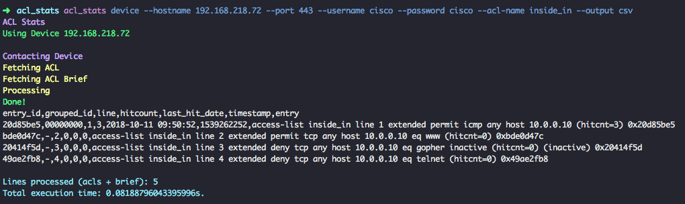

[](https://travis-ci.org/DiogoAndre/acl_stats)
[](https://developer.cisco.com/codeexchange/github/repo/DiogoAndre/acl_stats)

# ACL Stats

**Quickly gather access-lists stats from Cisco ASA Firewalls**

ACL Stats is a tool to help extract basic info from access-list from a
Cisco ASA Firewall, and output the information in a structured way.



The script currently collects the number of hits for each acl entry and the date of the last hit.

## Usage

First, install it via pip:

        pip install acl_stats

Use it as a command line tool. You can get contextual help in the cli:

        acl_stats --help

There are two main modes to pass the access-lists to the script.

### Directly from a Device

The script can connect to a device in the network and gather the informatoin needed. 
A connection is made via HTTPS (same transport as ASDM), hence the firewall will need to have that method enabled.

Run ``acl_stats device --help`` to get the contextual help listing all the available parameters:

```shell
        $ acl_stats device --help                                                                                                                                                                                                                                                    02:35:23
        ACL Stats
        Usage: acl_stats device [OPTIONS]

        Connect to a device to fech ACLs

        Options:
        --hostname TEXT  Hostname or IP of device to connect  [required]
        --port INTEGER   port to use when connection to a device  [required]
        --username TEXT  username to use when connection to a device  [required]
        --password TEXT  password to use when connection to a device  [required]
        --acl-name TEXT  Name of target ACL  [required]
        --output TEXT    Choose an output format: json, csv. Defaults to csv
        --write-to TEXT  Write the output to a file
        --help           Show this message and exit.
```

Here's an example:

```shell
        acl_stats device --hostname 192.168.218.72 --port 443 --username cisco --password cisco --acl-name inside_in --output json
```

If you ommit the ``--write-to`` parameter, the output will be sent to ``stdout``(the terminal, usually).

## From static files

You can also run the script 'off-line', using previously extracted command outputs.
The script processes one access-list at a time for now. Here are the two commands you need to save in **separete** files:

        show acess-list _name_of_acl
        show access-list _name_of_acl brief

Run ``acl_stats static --help`` to get the contextual help listing all the available parameters:

```shell
        $ acl_stats static --help                                                                                                                                                                                                                                                    02:47:19
        ACL Stats
        Usage: acl_stats static [OPTIONS]

        Use static files instead of connection to a device

        Options:
        --acl-file TEXT   File containing the output of the show acess-list _name_
                        command  [required]
        --acl-brief TEXT  File containing the output of the show acess-list _name_
                        brief command  [required]
        --output TEXT     Choose an output format: json, csv. Defaults to csv
        --write-to TEXT   Write the output to a file
        --help            Show this message and exit.
```

Here's an example:

```shell
        acl_stats static --acl-file acl.log --acl-brief acl_brief.log --output json --write-to acl-inside_in.csv
```

## Example Outputs

JSON Output

```json
        $ acl_stats acl_stats device --hostname 192.168.218.72 --port 443 --username cisco --password cisco --acl-name inside_in --output json                                                                                                                                                 02:47:23
        ACL Stats
        Using Device 192.168.218.72

        Contacting Device
        Fetching ACL
        Fetching ACL Brief
        Processing
        Done!
        [
        {
        "entry_id": "20d85be5",
        "grouped_id": "00000000",
        "line": "1",
        "hitcount": 3,
        "last_hit_date": "2018-10-11 09:50:52",
        "timestamp": 1539262252,
        "entry": "access-list inside_in line 1 extended permit icmp any host 10.0.0.10 (hitcnt=3) 0x20d85be5"
        },
        {
        "entry_id": "bde0d47c",
        "grouped_id": "-",
        "line": "2",
        "hitcount": 0,
        "last_hit_date": "0",
        "timestamp": 0,
        "entry": "access-list inside_in line 2 extended permit tcp any host 10.0.0.10 eq www (hitcnt=0) 0xbde0d47c"
        },
        {
        "entry_id": "20414f5d",
        "grouped_id": "-",
        "line": "3",
        "hitcount": 0,
        "last_hit_date": "0",
        "timestamp": 0,
        "entry": "access-list inside_in line 3 extended deny tcp any host 10.0.0.10 eq gopher inactive (hitcnt=0) (inactive) 0x20414f5d"
        },
        {
        "entry_id": "49ae2fb8",
        "grouped_id": "-",
        "line": "4",
        "hitcount": 0,
        "last_hit_date": "0",
        "timestamp": 0,
        "entry": "access-list inside_in line 4 extended deny tcp any host 10.0.0.10 eq telnet (hitcnt=0) 0x49ae2fb8"
        }
        ]
        Lines processed (acls + brief): 5
        Total execution time: 0.09016704559326172s.
```

CSV output:

```csv
        $ acl_stats acl_stats device --hostname 192.168.218.72 --port 443 --username cisco --password cisco --acl-name inside_in --output csv                                                                                                                                                  02:57:21
        ACL Stats
        Using Device 192.168.218.72

        Contacting Device
        Fetching ACL
        Fetching ACL Brief
        Processing
        Done!
        entry_id,grouped_id,line,hitcount,last_hit_date,timestamp,entry
        20d85be5,00000000,1,3,2018-10-11 09:50:52,1539262252,access-list inside_in line 1 extended permit icmp any host 10.0.0.10 (hitcnt=3) 0x20d85be5
        bde0d47c,-,2,0,0,0,access-list inside_in line 2 extended permit tcp any host 10.0.0.10 eq www (hitcnt=0) 0xbde0d47c
        20414f5d,-,3,0,0,0,access-list inside_in line 3 extended deny tcp any host 10.0.0.10 eq gopher inactive (hitcnt=0) (inactive) 0x20414f5d
        49ae2fb8,-,4,0,0,0,access-list inside_in line 4 extended deny tcp any host 10.0.0.10 eq telnet (hitcnt=0) 0x49ae2fb8

        Lines processed (acls + brief): 5
        Total execution time: 0.08188796043395996s.
```
